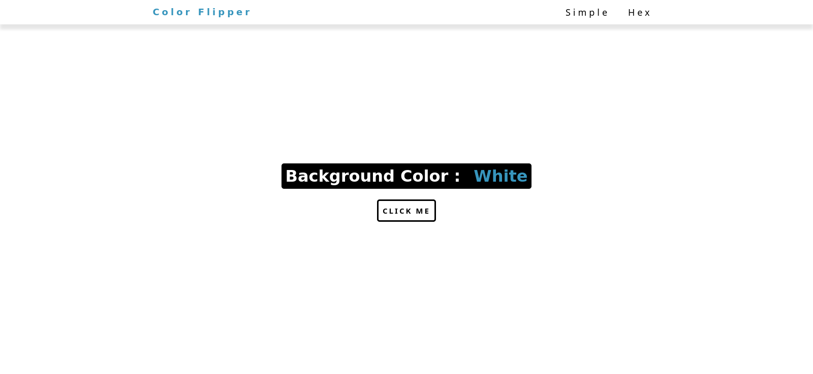

# Color Flipper App

Minimalist app that changes the background color and shows what color is selected.

## Screenshot

## Installation

1. Clone the repository git clone
2. Open the 'index.html' file in your browser.

## Usage

Select the set of colors you want to use on the top of the page, 'Simple' will select from an array of basic colors in CSS, 'Hex' will generate a random hex color code for you, increasing the color range available.

To start changing colors, click on the 'CLICK ME' button.

## Credits

This project was developed by [Alejandro Borges](https://github.com/AlexdelCarmen)
Inspired on the projects built by John Smilga on this [video](https://www.youtube.com/watch?v=3PHXvlpOkf4)

## License 

This project is released under the Unlicense [LICENSE](./LICENSE)